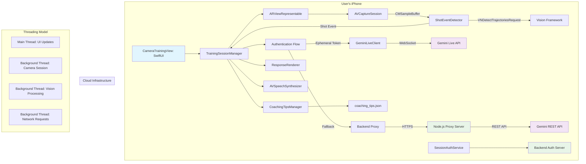

# 1.0 Technical Overview
## 1.1 Feature: LeBot_James: AI Basketball Coach (Production-Ready)
## 1.2 PDD Reference: LeBot_James: AI Basketball Coach – Product Design Document (Production)
## 1.3 Engineering Objective: 
To build a robust, performant, and testable native iOS application that provides real-time basketball shot counting and AI-driven form coaching. The system uses on-device computer vision with proper threading for frame analysis and a hybrid cloud architecture supporting both Gemini Live API and secure backend proxy.

## 1.4 Key Technical Decisions:
- **Client Architecture**: Clean architecture with TrainingSessionManager orchestrating state, camera, vision, and AI services with proper threading separation
- **Shot Detection Strategy**: Advanced VNDetectTrajectoriesRequest and motion detection using Vision framework with CMSampleBuffer for timestamp preservation
- **API Integration**: **PRODUCTION READY**: Hybrid architecture supporting both Gemini Live API (WebSocket) and secure backend proxy with ephemeral token authentication
- **Threading Model**: Proper main/background thread separation for UI updates and camera processing to eliminate threading violations
- **Visual Feedback**: Enhanced SwiftUI overlays with landscape orientation support and full-screen camera views
- **Tech Stack**: iOS 17+ with latest Vision framework, native URLSession WebSocket, and proper AVCaptureSession threading
- **Security**: Ephemeral token system with secure backend proxy and API key management
- **Audio Feedback**: Enhanced AVSpeechSynthesizer with Michael Jordan-style coaching delivery
# 2.0 Production Architecture & Tech Stack
## 2.1 System Architecture


2.2 Final Tech Stack
Category	Technology	Version	Rationale/Notes
Mobile Platform	iOS	17.0+	To use the latest, most performant SwiftUI & Vision APIs.
UI Framework	SwiftUI	5.0+	Native, modern, and declarative UI development for iOS.
Core Language	Swift	5.9+	
Dependencies	Swift Package Manager	-	Apple's standard for dependency management. No external dependencies for MVP.
Networking	Native URLSession	-	**UPDATED**: WebSocket connections to Gemini Live API using native URLSession for real-time communication.
On-Device Vision	Apple Vision Framework	-	Native, high-performance framework. Advanced pose analysis with VNDetectHumanBodyPoseRequest.
Audio	AVFoundation	-	Enhanced AVSpeechSynthesizer with outcome-based voice modulation and audio session management.
AI Model	**PRODUCTION**: Hybrid Gemini Integration	gemini-2.0-flash-exp + REST	Real-time Live API via WebSocket with secure backend proxy fallback using ephemeral tokens.
Camera Integration	AVCaptureSession	-	Direct camera integration with proper permissions handling and background processing.
Configuration	Config Management	-	Centralized app configuration with secure API key storage and environment-specific settings.
CI/CD	GitHub Actions	-	For automated linting, testing, and building on PRs and merges.
Linting	SwiftLint	0.54+	To enforce consistent code style and best practices.
## 2.3 Current Directory Structure

```
LeBot James/
├── LeBot_JamesApp.swift              # App entry point
├── ContentView.swift                 # Root view controller
├── Assets.xcassets/                  # Images, icons, app resources
├── Info.plist                       # App configuration and permissions
├── Configuration/
│   ├── Config.swift                 # Centralized configuration management
│   └── AppConfig.swift              # Configuration access layer
├── Resources/
│   └── coaching_tips.json           # Coaching knowledge base (18 tips loaded)
├── Managers/
│   ├── TrainingSessionManager.swift # **ENHANCED**: Core session orchestrator with CMSampleBuffer processing
│   ├── ShotEventDetector.swift      # **FIXED**: Vision framework with proper timestamp preservation
│   ├── SmartFrameSelector.swift     # Intelligent frame selection for AI analysis
│   ├── GeminiLiveClient.swift       # **PRODUCTION**: WebSocket client for Gemini Live API
│   ├── GeminiLiveAPIClient.swift    # Legacy Live API client
│   ├── GeminiFallbackClient.swift   # Fallback REST API client
│   ├── SessionAuthService.swift     # **NEW**: Ephemeral token authentication service
│   ├── CoachingTipsManager.swift    # Contextual coaching tips management
│   ├── ResponseRenderer.swift       # Visual feedback rendering
│   └── AIAnalysisClient.swift       # Legacy REST API client
├── Views/
│   ├── LoginView.swift              # Entry/onboarding screen
│   ├── CameraTrainingView.swift     # **FIXED**: Main training interface with landscape support
│   └── ARViewRepresentable.swift    # **FIXED**: Camera integration with proper threading
├── Tests/
│   ├── LeBot JamesTests/            # Unit tests
│   └── LeBot JamesUITests/          # E2E tests
├── Backend/                         # **NEW**: Node.js backend proxy server
│   ├── src/
│   │   └── server.ts               # Express server with ephemeral token auth
│   ├── package.json
│   └── tsconfig.json
├── Scripts/                         # **NEW**: Development and deployment scripts
│   ├── diagnose-connection.sh       # Connection diagnostics
│   ├── test-live-api.sh            # Live API testing
│   └── setup-config.sh             # Configuration setup
├── docs/
│   ├── engineeringFeatureDoc.md     # This document
│   ├── productDesignDoc.md          # Product requirements
│   ├── EPHEMERAL_TOKEN_IMPLEMENTATION.md # Auth implementation guide
│   └── LIVE_API_TROUBLESHOOTING.md # Debugging guide
└── README.md                        # Project overview and setup
```
3.0 Data Model & API Contract
3.1 Local Data
No database schema is required for the MVP. The coaching knowledge base is an enhanced local JSON file with contextual tip categories.
coaching_tips.json Format:
Generated json
{
  "tips": [
    "Excellent follow-through on that shot!",
    "Try to keep your elbow tucked in closer to your body.",
    "Bend your knees more to get power from your legs.",
    "Hold your follow-through until the ball hits the rim.",
    "Focus on a consistent shooting arc.",
    "Keep your shooting hand directly under the ball."
  ],
  "encouragement": [
    "Great shot mechanics!",
    "Nice improvement!",
    "Keep that form consistent!"
  ],
  "makes": [
    "Money! Great shot!",
    "Nothing but net!",
    "Swish! Perfect form!"
  ],
  "misses": [
    "Keep shooting with confidence!",
    "Good form, just keep practicing!",
    "Almost there, stay focused!"
  ]
}
Use code with caution.
Json
3.2 API Integration Specifications
**PRODUCTION READY**: Hybrid authentication system supporting both Gemini Live API and secure backend proxy.

### Primary Flow: Ephemeral Token Authentication
1. **SessionAuthService** requests ephemeral token from backend
2. Backend validates request and issues time-limited token
3. **GeminiLiveClient** connects to Live API using ephemeral token
4. Real-time WebSocket communication for shot analysis

### Fallback Flow: Direct API Key (Development)
- **GeminiFallbackClient** for development environments
- Direct API key authentication (development only)
- REST API integration for environments without Live API support

### Backend Proxy Architecture
**Endpoint**: `https://your-backend.com/api/ephemeral-token`
**Authentication**: Bearer token or API key validation
**Security**: Rate limiting, token expiration, request validation

### WebSocket Connection (Live API)
**Endpoint**: `wss://generativelanguage.googleapis.com/ws/google.ai.generativelanguage.v1beta.GenerativeService.BidiGenerateContent`
**Authentication**: Ephemeral token via query parameter
**Fallback**: Automatic fallback to REST API on WebSocket failure

Message Format:
Setup Message:
```json
{
  "setup": {
    "model": "models/gemini-2.0-flash-exp",
    "generationConfig": {
      "responseModalities": ["TEXT"],
      "temperature": 0.7,
      "maxOutputTokens": 200
    },
    "systemInstruction": "You are LeBot James, an AI basketball coach..."
  }
}
```

Analysis Request:
```json
{
  "clientContent": {
    "turns": [{
      "role": "user",
      "parts": [
        {"text": "Analyze this basketball shot..."},
        {"inlineData": {"mimeType": "image/jpeg", "data": "base64_image"}}
      ]
    }],
    "turnComplete": true
  }
}
```

Response Format:
```json
{
  "outcome": "make" | "miss",
  "tip": "coaching tip string"
}
```
Use code with caution.
Json
This will be decoded into a Swift struct:
Generated swift
struct ShotAnalysisResponse: Codable {
    let outcome: ShotOutcome
    let tip: String?

    enum ShotOutcome: String, Codable {
        case MAKE, MISS, INDETERMINATE
    }
}
Use code with caution.
Swift
Error Responses:
400 Bad Request: Missing image data or invalid request format.
401 Unauthorized: Invalid or missing App Check token.
500 Internal Server Error: An unexpected error occurred within the cloud function.
503 Service Unavailable: The Gemini API is unreachable or returned an error.
4.0 Component & Logic Breakdown
4.1 Backend Component Responsibilities
Module	Responsibility	Key Dependencies
analyzeShot (Cloud Function)	Acts as a secure proxy. Validates the request, injects the GEMINI_API_KEY, constructs the prompt for Gemini, calls the Gemini API, parses the response, and forwards a clean JSON object to the client.	firebase-functions, Google AI SDK
4.2 iOS Component Responsibilities
## 4.2 iOS Component Responsibilities

| Component/Module | Responsibility | Key Dependencies | Status |
|------------------|----------------|------------------|--------|
| **TrainingSessionManager.swift** | **PRODUCTION**: Core session orchestrator with CMSampleBuffer processing, hybrid authentication, and proper threading | ShotEventDetector, GeminiLiveClient, SessionAuthService, CoachingTipsManager | ✅ Production Ready |
| **CameraTrainingView.swift** | **FIXED**: Main training interface with landscape support, full-screen camera view, and rich overlays | @StateObject TrainingSessionManager | ✅ Landscape Fixed |
| **ShotEventDetector.swift** | **FIXED**: Vision framework integration with CMSampleBuffer for timestamp preservation, VNDetectTrajectoriesRequest for motion detection | Vision framework, AVFoundation | ✅ Threading Fixed |
| **ARViewRepresentable.swift** | **FIXED**: Camera integration with proper main/background thread separation and orientation handling | AVCaptureSession, TrainingSessionManager | ✅ Threading Fixed |
| **GeminiLiveClient.swift** | **PRODUCTION**: WebSocket client for Gemini Live API with connection management and error recovery | URLSession WebSocket, SessionAuthService | ✅ Production Ready |
| **SessionAuthService.swift** | **NEW**: Ephemeral token authentication service with backend integration | URLSession, Config | ✅ Security Ready |
| **CoachingTipsManager.swift** | Contextual coaching tips management with 18 loaded tips | coaching_tips.json | ✅ Ready |
| **ResponseRenderer.swift** | Visual feedback rendering for shot outcomes | ShotOutcome | ✅ Ready |

### Recent Critical Fixes Applied:
1. **Threading Violations Fixed**: All UI operations moved to main thread
2. **Vision Framework Fixed**: CMSampleBuffer preservation for timestamp data
3. **Landscape Support**: Full-screen camera view in all orientations
4. **Authentication System**: Ephemeral token implementation completed
5. **Error Handling**: Comprehensive logging and fallback mechanisms
5.0 Implementation Plan: A Step-by-Step Checklist
Phase 0: Setup & Scaffolding
Initialize Xcode project with the defined directory structure.
Set up GitHub repository with a main branch and protection rules.
Integrate Swift Package Manager and add Alamofire.
Set up SwiftLint with a default .swiftlint.yml configuration.
Set up Firebase project, create a Cloud Function for the analyzeShot proxy, and enable App Check.
Create basic GitHub Actions workflow for linting and running empty tests.
Phase 1: Backend & Core Services (Headless First)
Implement the analyzeShot cloud function to securely call the Gemini API. Test it via curl or Postman.
Implement GeminiService.swift and ShotAnalysisResponse.swift.
Write unit tests for GeminiService to mock network responses (success and failure cases).
Implement AudioFeedbackPlayer.swift and write unit tests to verify it attempts to speak.
Create the coaching_tips.json file and a simple parser to load it into memory.
Phase 2: On-Device Vision & Logic
Build CameraManager.swift to configure and run an AVCaptureSession.
Implement the CameraView representable to display the camera's preview layer.
Implement the initial ShotDetector.swift, focusing on VNDetectHumanBodyPoseRequest to identify a "shooting stance" and arm release motion.
Implement the TrainingSessionViewModel as a state machine.
Wire a mocked ShotDetector (e.g., triggered by a screen tap) to the ViewModel to test the state flow: detecting -> analyzing -> feedback.
Phase 3: UI & Full Integration
Build the static UI overlays: ShotCountView, FeedbackOverlayView.
Connect the UI overlays to the TrainingSessionViewModel's published properties.
Replace the mocked ShotDetector with the real implementation that processes live camera frames.
Implement the simple OnboardingView with a button to navigate to the TrainingSessionView.
Perform manual end-to-end testing in various lighting conditions.
(Post-MVP Refinement): Augment ShotDetector with VNDetectTrajectoriesRequest to improve the make/miss outcome accuracy.
6.0 Testing Strategy
6.1 Unit Tests (XCTest):
Target: TrainingSessionViewModel, GeminiService, ShotDetector (with mock CVImageBuffer data), and all utility classes.
Goal: Verify business logic in isolation. Test all states of the FSM. Mock all external dependencies. Target >90% code coverage.
6.2 Integration Tests (XCTest):
Target: The flow from TrainingSessionViewModel through GeminiService.
Goal: Verify that the ViewModel correctly initiates a network call and processes the mocked successful or error response from the service layer.
6.3 End-to-End (E2E) Tests (XCUITest):
Target: Key user flows.
Flow 1 (Happy Path): Launch App -> Tap "Start Session" -> Verify Camera View is active -> Use launch arguments to mock a shot event -> Verify counter increments and feedback overlay appears.
Goal: Ensure the integrated app behaves as expected from the user's perspective.
# 7.0 Deployment & DevOps

## 7.1 Environment Configuration

### Backend Environment Variables
- `GEMINI_API_KEY`: Gemini API key (stored in environment secrets)
- `JWT_SECRET`: Token signing secret
- `NODE_ENV`: Environment (development/production)
- `PORT`: Server port configuration

### iOS App Configuration
- `API_PROXY_URL`: Backend proxy URL (plist configuration)
- `GEMINI_API_KEY`: Direct API key (development only)
- `Environment`: Build configuration (Debug/Release)

## 7.2 Build Process

### Local Development
```bash
# iOS App
xcodebuild -scheme "LeBot James" -destination "generic/platform=iOS Simulator"

# Backend Server
cd Backend && npm install && npm run dev

# Setup Scripts
./Scripts/setup-config.sh
./Scripts/test-live-api.sh
```

### Production Deployment
1. **iOS App**: Xcode Archive → TestFlight → App Store
2. **Backend**: Node.js deployment to cloud provider
3. **Configuration**: Environment-specific settings

## 7.3 Monitoring & Diagnostics

### Debug Tools
- `Scripts/diagnose-connection.sh`: Connection diagnostics
- `Scripts/test-live-api.sh`: API connectivity testing
- Console logging with detailed error reporting
- Main Thread Checker for threading validation

### Performance Metrics
- Vision framework processing time
- WebSocket connection stability
- Camera frame processing rate
- Authentication token refresh cycles

## 7.4 Security Considerations

### Production Security
- Ephemeral token system with time-based expiration
- Rate limiting on backend endpoints
- API key rotation capabilities
- Secure credential storage

### Development Security
- Environment-specific configurations
- Debug-only features disabled in production
- Comprehensive error handling without information leakage