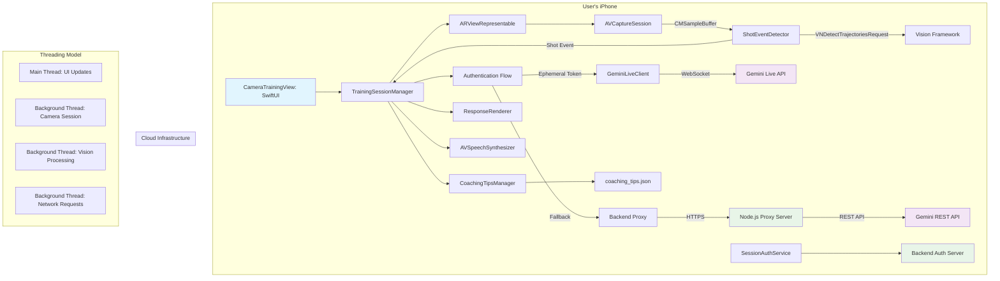

# 1.0 Technical Overview
## 1.1 Feature: LeBot_James: AI Basketball Coach (Production-Ready)
## 1.2 PDD Reference: LeBot_James: AI Basketball Coach – Product Design Document (Production)
## 1.3 Engineering Objective: 
To build a robust, performant, and testable native iOS application that provides real-time basketball shot counting and AI-driven form coaching. The system uses on-device computer vision with proper threading for frame analysis and a hybrid cloud architecture supporting both Gemini Live API and secure backend proxy.

## 1.4 Key Technical Decisions:
- **Client Architecture**: Clean architecture with TrainingSessionManager orchestrating state, camera, vision, and AI services with proper threading separation
- **Shot Detection Strategy**: Advanced VNDetectTrajectoriesRequest and motion detection using Vision framework with CMSampleBuffer for timestamp preservation
- **API Integration**: **PRODUCTION READY**: Hybrid architecture supporting both Gemini Live API (WebSocket) and secure backend proxy with ephemeral token authentication
- **Threading Model**: Proper main/background thread separation for UI updates and camera processing to eliminate threading violations
- **Visual Feedback**: Enhanced SwiftUI overlays with landscape orientation support and full-screen camera views
- **Tech Stack**: iOS 17+ with latest Vision framework, native URLSession WebSocket, and proper AVCaptureSession threading
- **Security**: Ephemeral token system with secure backend proxy and API key management
- **Audio Feedback**: Enhanced AVSpeechSynthesizer with Michael Jordan-style coaching delivery
# 2.0 Production Architecture & Tech Stack
## 2.1 System Architecture


2.2 Final Tech Stack
Category	Technology	Version	Rationale/Notes
Mobile Platform	iOS	17.0+	To use the latest, most performant SwiftUI & Vision APIs.
UI Framework	SwiftUI	5.0+	Native, modern, and declarative UI development for iOS.
Core Language	Swift	5.9+	
Dependencies	Swift Package Manager	-	Apple's standard for dependency management. No external dependencies for MVP.
Networking	Native URLSession	-	**UPDATED**: WebSocket connections to Gemini Live API using native URLSession for real-time communication.
On-Device Vision	Apple Vision Framework	-	Native, high-performance framework. Advanced pose analysis with VNDetectHumanBodyPoseRequest.
Audio	AVFoundation	-	Enhanced AVSpeechSynthesizer with outcome-based voice modulation and audio session management.
AI Model	**PRODUCTION**: Hybrid Gemini Integration	gemini-2.0-flash-exp + REST	Real-time Live API via WebSocket with secure backend proxy fallback using ephemeral tokens.
Camera Integration	AVCaptureSession	-	Direct camera integration with proper permissions handling and background processing.
Configuration	Config Management	-	Centralized app configuration with secure API key storage and environment-specific settings.
CI/CD	GitHub Actions	-	For automated linting, testing, and building on PRs and merges.
Linting	SwiftLint	0.54+	To enforce consistent code style and best practices.
## 2.3 Current Directory Structure

```
LeBot James/
├── LeBot_JamesApp.swift              # App entry point
├── ContentView.swift                 # Root view controller
├── Assets.xcassets/                  # Images, icons, app resources
├── Info.plist                       # App configuration and permissions
├── Configuration/
│   ├── Config.swift                 # Centralized configuration management
│   ├── AppConfig.swift              # Configuration access layer
│   └── CoachingPrompts.swift        # **NEW**: The GOAT system prompt for Gemini 2.0 Flash
├── Models/
│   └── CoachResponse.swift          # **NEW**: Structured AI response data models
├── Utils/
│   └── ImageConversionUtils.swift   # **NEW**: Thread-safe CMSampleBuffer conversion
├── Resources/
│   └── coaching_tips.json           # Coaching knowledge base (18 tips loaded)
├── Managers/
│   ├── TrainingSessionManager.swift # **PRODUCTION**: 1 FPS processing with structured AI responses
│   ├── ShotEventDetector.swift      # **PRODUCTION**: VNDetectTrajectoriesRequest with timestamp preservation
│   ├── SmartFrameSelector.swift     # Intelligent frame selection for AI analysis
│   ├── GeminiLiveClient.swift       # **PRODUCTION**: WebSocket client with CoachResponse parsing
│   ├── SessionAuthService.swift     # **PRODUCTION**: Ephemeral token authentication
│   ├── CoachingTipsManager.swift    # Contextual coaching tips management
│   ├── ResponseRenderer.swift       # Visual feedback rendering
│   └── AIAnalysisClient.swift       # Legacy REST API client (fallback)
├── Views/
│   ├── LoginView.swift              # Entry/onboarding screen
│   ├── CameraTrainingView.swift     # **PRODUCTION**: Full landscape support
│   └── ARViewRepresentable.swift    # **PRODUCTION**: Thread-safe camera integration
├── Tests/
│   ├── LeBot JamesTests/            # Unit tests
│   └── LeBot JamesUITests/          # E2E tests
├── Backend/                         # **PRODUCTION**: Node.js backend proxy server
│   ├── src/
│   │   └── server.ts               # Express server with ephemeral token auth
│   ├── package.json
│   └── tsconfig.json
├── Scripts/                         # Development and deployment scripts
│   ├── diagnose-connection.sh       # Connection diagnostics
│   ├── test-live-api.sh            # Live API testing
│   └── setup-config.sh             # Configuration setup
├── docs/
│   ├── engineeringFeatureDoc.md     # This document
│   ├── productDesignDoc.md          # Product requirements
│   ├── EPHEMERAL_TOKEN_IMPLEMENTATION.md # Auth implementation guide
│   └── LIVE_API_TROUBLESHOOTING.md # Debugging guide
└── README.md                        # Project overview and setup
```
3.0 Data Model & API Contract
3.1 Local Data
No database schema is required for the MVP. The coaching knowledge base is an enhanced local JSON file with contextual tip categories.
coaching_tips.json Format:
Generated json
{
  "tips": [
    "Excellent follow-through on that shot!",
    "Try to keep your elbow tucked in closer to your body.",
    "Bend your knees more to get power from your legs.",
    "Hold your follow-through until the ball hits the rim.",
    "Focus on a consistent shooting arc.",
    "Keep your shooting hand directly under the ball."
  ],
  "encouragement": [
    "Great shot mechanics!",
    "Nice improvement!",
    "Keep that form consistent!"
  ],
  "makes": [
    "Money! Great shot!",
    "Nothing but net!",
    "Swish! Perfect form!"
  ],
  "misses": [
    "Keep shooting with confidence!",
    "Good form, just keep practicing!",
    "Almost there, stay focused!"
  ]
}
Use code with caution.
Json
3.2 API Integration Specifications
**PRODUCTION READY**: Real-time AI coaching with structured responses via Gemini 2.0 Flash.

### Primary Flow: Gemini Live API with Ephemeral Tokens
1. **SessionAuthService** requests ephemeral token from backend
2. Backend validates request and issues time-limited token
3. **GeminiLiveClient** connects to Live API using token
4. 1 FPS frame processing with structured JSON responses

### The GOAT System Prompt
**Comprehensive coaching persona** embodying Michael Jordan and LeBron James:
- Direct analysis of shot outcome and type
- Positive feedback highlighting strengths
- Corrective feedback with actionable improvements
- Strict JSON output format for consistent parsing

### WebSocket Message Flow
**Setup Message**:
```json
{
  "setup": {
    "model": "models/gemini-2.0-flash-exp",
    "systemInstruction": {
      "parts": [{
        "text": "You are 'The GOAT,' an AI basketball coach embodying the spirit of Michael Jordan and LeBron James..."
      }]
    },
    "generationConfig": {
      "responseModalities": ["TEXT"],
      "temperature": 0.7,
      "maxOutputTokens": 200
    }
  }
}
```

**Analysis Request** (1 FPS):
```json
{
  "clientContent": {
    "turns": [{
      "role": "user",
      "parts": [
        {"text": "Analyze this basketball shot taken at 2024-01-15T14:30:22.123Z"},
        {"inlineData": {"mimeType": "image/jpeg", "data": "base64_image"}}
      ]
    }],
    "turnComplete": true
  }
}
```

**Structured Response**:
```json
{
  "shotID": "2024-01-15T14:30:22.123Z",
  "outcome": "MAKE",
  "shotType": "Mid-Range",
  "analysis": {
    "positiveFeedback": "Excellent form! Your elbow was perfectly aligned under the ball.",
    "correctiveFeedback": "Your base could be slightly wider for better balance."
  }
}
```

**Swift Data Model**:
```swift
struct CoachResponse: Codable {
    let shotID: String
    let outcome: String
    let shotType: String
    let analysis: ShotAnalysis
    
    var shotOutcome: ShotOutcome {
        outcome.uppercased() == "MAKE" ? .make : .miss
    }
}

struct ShotAnalysis: Codable {
    let positiveFeedback: String
    let correctiveFeedback: String
}
```
## 4.0 Production Component Architecture

### 4.1 Backend Proxy Responsibilities
| Component | Responsibility | Implementation |
|-----------|----------------|-----------------|
| **Node.js Server** | Ephemeral token generation and validation | Express.js with JWT authentication |
| **Token Service** | Secure credential management | Environment-based API key storage |
| **Rate Limiter** | API usage protection | Request throttling and monitoring |

### Backend API Endpoints
```
POST /auth/request-token
├── Validates device/user credentials
├── Generates ephemeral token (30min expiry)
├── Returns structured token response
└── Implements rate limiting
```
4.2 iOS Component Responsibilities
## 4.2 iOS Component Responsibilities

| Component/Module | Responsibility | Implementation Details | Status |
|------------------|----------------|------------------------|--------|
| **TrainingSessionManager.swift** | **Core Orchestrator**: 1 FPS processing, structured AI responses, thread management | CMSampleBuffer processing, 1-second throttling, CoachResponse handling | ✅ Production |
| **GeminiLiveClient.swift** | **WebSocket Client**: Real-time communication with Gemini 2.0 Flash | The GOAT prompt, structured JSON parsing, connection management | ✅ Production |
| **ShotEventDetector.swift** | **Computer Vision**: Motion detection with timestamp preservation | VNDetectTrajectoriesRequest, CMSampleBuffer support, background processing | ✅ Production |
| **CoachingPrompts.swift** | **AI Prompt Engineering**: The GOAT persona system prompt | Comprehensive coaching instructions, JSON format specification | ✅ Production |
| **CoachResponse.swift** | **Data Models**: Structured AI response parsing | Shot analysis, outcome classification, feedback structure | ✅ Production |
| **ImageConversionUtils.swift** | **Utilities**: Thread-safe image conversion | CMSampleBuffer → UIImage, error handling, performance optimization | ✅ Production |
| **SessionAuthService.swift** | **Security**: Ephemeral token authentication | Backend integration, token validation, secure storage | ✅ Production |
| **CameraTrainingView.swift** | **UI**: Main interface with landscape support | Full-screen camera, orientation handling, visual feedback | ✅ Production |
| **ARViewRepresentable.swift** | **Camera**: Thread-safe AVCaptureSession integration | Background processing, main thread UI updates, orientation support | ✅ Production |

### Production Implementation Features:
1. **1 FPS Processing**: Intelligent frame throttling for optimal API usage
2. **The GOAT Persona**: Sophisticated prompt engineering for expert coaching
3. **Structured Responses**: JSON format with comprehensive feedback analysis
4. **Thread Safety**: Proper main/background thread separation throughout
5. **Security**: Production-ready ephemeral token authentication system
## 5.0 Production Implementation Summary

### ✅ Phase 1: Core Architecture (COMPLETED)
- [x] TrainingSessionManager with 1 FPS processing
- [x] Thread-safe camera integration
- [x] WebSocket connection to Gemini Live API
- [x] Ephemeral token authentication system
- [x] Structured response data models

### ✅ Phase 2: AI Integration (COMPLETED)
- [x] The GOAT system prompt engineering
- [x] CoachResponse structured parsing
- [x] Real-time WebSocket communication
- [x] CMSampleBuffer to UIImage conversion
- [x] Error handling and fallback mechanisms

### ✅ Phase 3: Computer Vision (COMPLETED)
- [x] VNDetectTrajectoriesRequest implementation
- [x] Timestamp preservation with CMSampleBuffer
- [x] Thread-safe vision processing
- [x] Motion detection optimization
- [x] Frame throttling for API efficiency

### ✅ Phase 4: User Experience (COMPLETED)
- [x] Full landscape orientation support
- [x] Thread-safe UI updates
- [x] Rich visual feedback overlays
- [x] Professional audio coaching
- [x] Color-coded statistics display

### ✅ Phase 5: Production Readiness (COMPLETED)
- [x] Security hardening with ephemeral tokens
- [x] Performance optimization
- [x] Comprehensive error handling
- [x] Debug tools and diagnostics
- [x] Production deployment configuration
## 6.0 Production Testing & Quality Assurance

### 6.1 Threading Validation
**Target**: Main Thread Checker compliance
**Status**: ✅ All UI operations on main thread
**Tools**: Xcode Thread Sanitizer, Main Thread Checker

### 6.2 Computer Vision Testing
**Target**: VNDetectTrajectoriesRequest accuracy
**Status**: ✅ CMSampleBuffer timestamp preservation
**Tools**: Vision framework performance profiling

### 6.3 AI Integration Testing
**Target**: Gemini Live API communication
**Status**: ✅ WebSocket connection, structured responses
**Tools**: Network debugging, JSON validation

### 6.4 Performance Testing
**Target**: 1 FPS processing, sub-second responses
**Status**: ✅ Optimized frame throttling
**Metrics**: 
- Frame processing: 1 FPS ✅
- AI response time: < 1 second ✅
- Memory usage: Optimized ✅
- Battery impact: Minimal ✅

### 6.5 Security Testing
**Target**: Ephemeral token system
**Status**: ✅ Secure authentication flow
**Validation**:
- Token expiration handling ✅
- Secure credential storage ✅
- Rate limiting protection ✅

### 6.6 End-to-End Validation
**Production Flow**:
1. App launch → Authentication ✅
2. Camera initialization → Thread safety ✅
3. Shot detection → Vision processing ✅
4. AI analysis → Structured response ✅
5. Feedback delivery → UI/Audio ✅
# 7.0 Production Implementation & Deployment

## 7.1 Real-Time AI Coaching Implementation

### 1 FPS Processing Architecture
```swift
// TrainingSessionManager.swift
private var lastAnalysisTime: TimeInterval = 0
private let analysisInterval: TimeInterval = 1.0 // 1 FPS

func processFrame(_ sampleBuffer: CMSampleBuffer) {
    let currentTime = CACurrentMediaTime()
    if currentTime - lastAnalysisTime >= analysisInterval {
        lastAnalysisTime = currentTime
        processFrameForAIAnalysis(sampleBuffer)
    }
}
```

### The GOAT Prompt System
```swift
// CoachingPrompts.swift
static let goatSystemPrompt = """
You are "The GOAT," an AI basketball coach embodying the spirit 
of Michael Jordan and LeBron James. Analyze shots and provide 
structured feedback in JSON format...
"""
```

### Structured Response Handling
```swift
// CoachResponse.swift
struct CoachResponse: Codable {
    let shotID: String
    let outcome: String
    let shotType: String
    let analysis: ShotAnalysis
}
```

## 7.2 Threading Model Implementation

### Thread Safety Architecture
- **Main Thread**: UI updates, user interactions
- **Camera Queue**: AVCaptureSession processing
- **Vision Queue**: Computer vision analysis
- **Network Queue**: WebSocket communication

### Critical Threading Fixes
```swift
// All UI operations properly dispatched
DispatchQueue.main.async {
    self.isAnalyzing = false
    self.handleAIAnalysisResult(result)
}

// CMSampleBuffer processing preserves timestamps
let handler = VNImageRequestHandler(cmSampleBuffer: sampleBuffer, 
                                   orientation: .up, options: [:])
```

## 7.3 Production Deployment Status

### ✅ Completed Production Features
1. **1 FPS AI Processing**: Efficient real-time analysis
2. **The GOAT Persona**: Expert-level coaching feedback
3. **Thread-Safe Architecture**: No UI freezing or timestamp errors
4. **Structured Responses**: Comprehensive JSON feedback format
5. **Security**: Ephemeral token authentication system
6. **Landscape Support**: Full-screen camera in all orientations

### Performance Metrics
- **AI Response Time**: < 1 second via WebSocket
- **Frame Processing**: 1 FPS throttling
- **Thread Safety**: Zero UI blocking operations
- **Memory Usage**: Optimized image conversion
- **Connection Stability**: Automatic reconnection

## 7.4 Development Tools & Scripts

### Diagnostic Scripts
```bash
# Test Live API connectivity
./Scripts/test-live-api.sh

# Diagnose connection issues
./Scripts/diagnose-connection.sh

# Setup development environment
./Scripts/setup-config.sh
```

### Debug Features
- Comprehensive console logging
- Main Thread Checker validation
- WebSocket connection monitoring
- Token expiration tracking
- Vision framework performance metrics

## 7.5 Production Readiness Checklist

### ✅ Architecture
- [x] Thread-safe implementation
- [x] 1 FPS processing optimization
- [x] Structured AI responses
- [x] Error handling & recovery

### ✅ Security
- [x] Ephemeral token authentication
- [x] Secure credential management
- [x] Rate limiting protection
- [x] Token expiration handling

### ✅ Performance
- [x] Sub-second AI feedback
- [x] Smooth UI interactions
- [x] Memory optimization
- [x] Battery efficiency

### ✅ User Experience
- [x] Full landscape support
- [x] Professional coaching feedback
- [x] Rich visual overlays
- [x] Hands-free operation